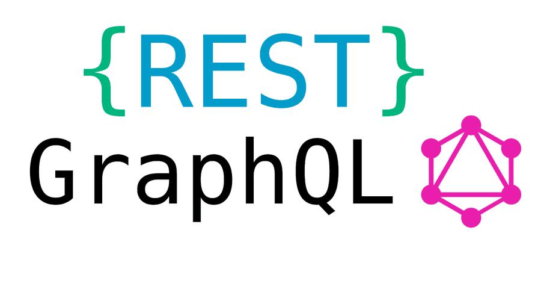

# Scalable API Architecture

[](https://app.codacy.com/app/ashokdey/rest-and-graphql?utm_source=github.com&utm_medium=referral&utm_content=knaxus/rest-and-graphql&utm_campaign=Badge_Grade_Dashboard)

This repository is a demostration of highly scalable & easily maintainable codebase architecture for both **REST & GraphQL API** interface.



## Tech Stack

- Node.js
- GraphQL
- MySQL

## Work Progress

- Upcoming APIs in this repo
  - User Registration
  - ACL
  - Admin Portal
  - Seller Portal
- Unit Testing
  - REST endpoints
  - GraphQL endpoints
- CI and CD

## Run locally

- Clone the repo
- `npm install`
- Setup a `.env` file at the root of the repo
- `npm run dev`
- GraphQL endpoint will be http://localhost:PORT/graphql

## Notes

- Contents of `.env` file

```env
PORT=8080
NODE_ENV = development
READ_DB_HOST = localhost
READ_DB_USER = root
READ_DB_PASSWORD = password
READ_DB_NAME = awesome_products
READ_DB_PORT = 3306
READ_DB_CONNECTION_LIMIT = 10
WRITE_DB_HOST = localhost
WRITE_DB_USER = root
WRITE_DB_PASSWORD = password
WRITE_DB_NAME = awesome_products
WRITE_DB_PORT = 3306
WRITE_DB_CONNECTION_LIMIT = 10
```

- Use the `SQL` file located in `resources` folder to create the database

<a rel="license" href="http://creativecommons.org/licenses/by/3.0/"></a><br />This work is licensed under a <a rel="license" href="http://creativecommons.org/licenses/by/3.0/">Creative Commons Attribution 3.0 Unported License</a>.
